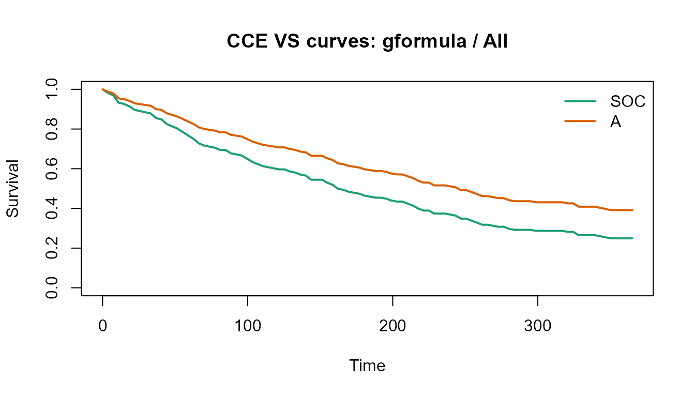
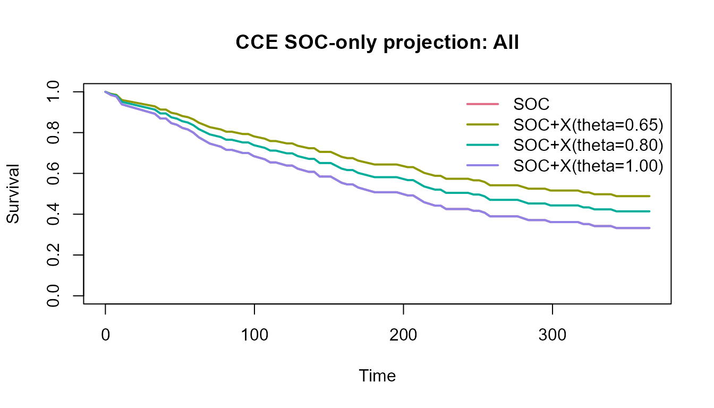

# Demo-data workflow

## Overview

This article shows the full CCE workflow on bundled synthetic data:

1.  create normalized source tables
2.  build an analysis-ready cohort
3.  estimate a VS-mode comparison
4.  run SOC-only projection scenarios
5.  export results for reporting

## Generate the example data

``` r
library(cce)

demo <- cce_demo_data(n = 240, seed = 42)
names(demo)
#> [1] "patient_baseline"   "treatment_episodes" "outcomes"          
#> [4] "biomarkers"         "spec"               "analysis_data"
```

The demo generator returns the four normalized tables plus a ready-made
analysis dataset.

``` r
str(demo$analysis_data)
#> Classes 'cce_dataset' and 'data.frame':  240 obs. of  13 variables:
#>  $ patient_id         : chr  "P0001" "P0002" "P0003" "P0004" ...
#>  $ index_date         : Date, format: "2022-02-18" "2022-03-06" ...
#>  $ age                : num  68 65 72 62 72 48 79 72 63 51 ...
#>  $ sex                : chr  "F" "F" "F" "M" ...
#>  $ histology          : chr  "Adenocarcinoma" "Squamous" "Adenocarcinoma" "Adenocarcinoma" ...
#>  $ stage_or_risk      : chr  "III" "IV" "IV" "IV" ...
#>  $ ps                 : int  0 2 0 0 1 1 2 1 0 0 ...
#>  $ arm                : Factor w/ 2 levels "SOC","A": 2 1 2 1 1 1 2 1 1 2 ...
#>  $ start_date         : Date, format: "2022-02-18" "2022-03-06" ...
#>  $ time               : num  371 12 212 107 296 78 53 121 9 270 ...
#>  $ event              : int  1 1 0 1 1 1 1 1 1 1 ...
#>  $ last_follow_up_date: Date, format: "2023-02-24" "2022-03-18" ...
#>  $ subgroup           : chr  "High" "Low" "Low" "Low" ...
#>  - attr(*, "spec")=List of 18
#>   ..$ covariates                 : chr [1:4] "age" "sex" "stage_or_risk" "ps"
#>   ..$ subgroup_biomarker         : chr "PDL1"
#>   ..$ endpoint                   : chr "os"
#>   ..$ id_col                     : chr "patient_id"
#>   ..$ index_date_col             : chr "index_date"
#>   ..$ regimen_col                : chr "regimen_name"
#>   ..$ treatment_start_col        : chr "start_date"
#>   ..$ index_flag_col             : chr "is_index_treatment"
#>   ..$ endpoint_col               : chr "endpoint"
#>   ..$ time_col                   : chr "time"
#>   ..$ event_col                  : chr "event"
#>   ..$ follow_up_col              : chr "last_follow_up_date"
#>   ..$ biomarker_name_col         : chr "biomarker_name"
#>   ..$ biomarker_value_col        : chr "biomarker_value"
#>   ..$ biomarker_baseline_flag_col: chr "is_baseline"
#>   ..$ arm_map                    : Named chr [1:2] "SOC" "A"
#>   .. ..- attr(*, "names")= chr [1:2] "SOC" "A"
#>   ..$ missing_strategy           : chr "complete_case"
#>   ..$ time_zero_tolerance_days   : int 0
#>   ..- attr(*, "class")= chr "cce_spec"
#>  - attr(*, "exclusions")='data.frame':   1 obs. of  2 variables:
#>   ..$ reason: chr "missing_required_fields"
#>   ..$ n     : int 0
```

## Round-trip the analysis specification

``` r
spec_path <- tempfile(fileext = ".yml")
write_cce_spec(demo$spec, spec_path)
roundtrip_spec <- read_cce_spec(spec_path)
roundtrip_spec$covariates
#> [1] "age"           "sex"           "stage_or_risk" "ps"
```

## Rebuild the analysis dataset from normalized tables

``` r
analysis <- build_analysis_dataset(
  patient_baseline = demo$patient_baseline,
  treatment_episodes = demo$treatment_episodes,
  outcomes = demo$outcomes,
  biomarkers = demo$biomarkers,
  spec = roundtrip_spec
)

head(analysis)
#>   patient_id index_date age sex      histology stage_or_risk ps arm start_date
#> 1      P0001 2022-02-18  68   F Adenocarcinoma           III  0   A 2022-02-18
#> 2      P0002 2022-03-06  65   F       Squamous            IV  2 SOC 2022-03-06
#> 3      P0003 2022-06-02  72   F Adenocarcinoma            IV  0   A 2022-06-02
#> 4      P0004 2022-03-15  62   M Adenocarcinoma            IV  0 SOC 2022-03-15
#> 5      P0005 2022-05-26  72   M Adenocarcinoma            IV  1 SOC 2022-05-26
#> 6      P0006 2022-05-02  48   M Adenocarcinoma            IV  1 SOC 2022-05-02
#>   time event last_follow_up_date subgroup
#> 1  371     1          2023-02-24     High
#> 2   12     1          2022-03-18      Low
#> 3  212     0          2022-12-31      Low
#> 4  107     1          2022-06-30      Low
#> 5  296     1          2023-03-18     High
#> 6   78     1          2022-07-19      Low
```

## VS-mode estimation

``` r
vs_fit <- fit_cce_vs(
  data = analysis,
  arm = "arm",
  time = "time",
  event = "event",
  covariates = c("age", "sex", "stage_or_risk", "ps"),
  subgroup = "subgroup",
  tau = 365,
  landmark_times = c(180, 365),
  bootstrap = 20,
  seed = 100
)

summary(vs_fit)
#> CCE VS result
#> Label: ok 
#> Warnings: none 
#>   mode   method subgroup tau rmst_arm0 rmst_arm1 delta_rmst landmark_time
#> 1   vs gformula      All 365  188.1689  229.3371   41.16822           180
#> 2   vs gformula      All 365  188.1689  229.3371   41.16822           365
#> 3   vs     iptw      All 365  212.9197  250.6222   37.70248           180
#> 4   vs     iptw      All 365  212.9197  250.6222   37.70248           365
#> 5   vs gformula     High 365  273.6294  313.9454   40.31598           180
#> 6   vs gformula     High 365  273.6294  313.9454   40.31598           365
#>   survival_arm0 survival_arm1 delta_survival delta_rmst_lower_ci
#> 1     0.4739779     0.6057646      0.1317867           10.780157
#> 2     0.2492317     0.3914337      0.1422019           10.780157
#> 3     0.5536321     0.6708851      0.1172530            9.650522
#> 4     0.3328632     0.4758616      0.1429984            9.650522
#> 5     0.7562308     0.8674062      0.1111754            4.487278
#> 6     0.5416310     0.7308945      0.1892634            4.487278
#>   delta_rmst_upper_ci delta_survival_lower_ci delta_survival_upper_ci
#> 1            51.67511              0.03257590               0.1572542
#> 2            51.67511              0.01287977               0.1960966
#> 3            55.57671              0.03102979               0.1685626
#> 4            55.57671              0.03443802               0.2109653
#> 5            99.17120              0.01037481               0.3216487
#> 6            99.17120              0.02652063               0.3774753
```

``` r
plot(vs_fit, method = "gformula", subgroup = "All")
```



The tidy effects table is designed to feed downstream reports or
dashboards.

``` r
head(as_effects_df(vs_fit))
#>   mode   method subgroup tau rmst_arm0 rmst_arm1 delta_rmst landmark_time
#> 1   vs gformula      All 365  188.1689  229.3371   41.16822           180
#> 2   vs gformula      All 365  188.1689  229.3371   41.16822           365
#> 3   vs     iptw      All 365  212.9197  250.6222   37.70248           180
#> 4   vs     iptw      All 365  212.9197  250.6222   37.70248           365
#> 5   vs gformula     High 365  273.6294  313.9454   40.31598           180
#> 6   vs gformula     High 365  273.6294  313.9454   40.31598           365
#>   survival_arm0 survival_arm1 delta_survival delta_rmst_lower_ci
#> 1     0.4739779     0.6057646      0.1317867           10.780157
#> 2     0.2492317     0.3914337      0.1422019           10.780157
#> 3     0.5536321     0.6708851      0.1172530            9.650522
#> 4     0.3328632     0.4758616      0.1429984            9.650522
#> 5     0.7562308     0.8674062      0.1111754            4.487278
#> 6     0.5416310     0.7308945      0.1892634            4.487278
#>   delta_rmst_upper_ci delta_survival_lower_ci delta_survival_upper_ci
#> 1            51.67511              0.03257590               0.1572542
#> 2            51.67511              0.01287977               0.1960966
#> 3            55.57671              0.03102979               0.1685626
#> 4            55.57671              0.03443802               0.2109653
#> 5            99.17120              0.01037481               0.3216487
#> 6            99.17120              0.02652063               0.3774753
```

Diagnostics are returned in a machine-readable table.

``` r
head(as_diagnostics_df(vs_fit))
#>   method subgroup             metric        value threshold  status
#> 1   iptw      All         max_weight   1.30235194      50.0      ok
#> 2   iptw      All          ess_total 238.61717626        NA    info
#> 3   iptw      All           ess_arm0 129.23701922        NA    info
#> 4   iptw      All           ess_arm1 109.38039627        NA    info
#> 5   iptw      All max_abs_smd_before   0.12160316       0.1 warning
#> 6   iptw      All  max_abs_smd_after   0.00168784       0.1      ok
```

## SOC-only projection

``` r
soc_fit <- project_soc_only(
  data = analysis,
  arm = "arm",
  soc_level = "SOC",
  time = "time",
  event = "event",
  subgroup = "subgroup",
  tau = 365,
  hr_scenarios = c(0.65, 0.80, 1.00),
  target_delta_rmst = 30,
  prior_mean_log_hr = log(0.8),
  prior_sd_log_hr = 0.25,
  bootstrap = 20,
  seed = 200
)

summary(soc_fit)
#> CCE SOC-only projection
#> Label: Projection (assumption-based) 
#>       mode        method subgroup scenario_hr tau rmst_arm0 rmst_arm1
#> 1 soc_only projection_ph      All        0.65 365  205.9825  248.3459
#> 2 soc_only projection_ph      All        0.65 365  205.9825  248.3459
#> 3 soc_only projection_ph      All        0.80 365  205.9825  228.8191
#> 4 soc_only projection_ph      All        0.80 365  205.9825  228.8191
#> 5 soc_only projection_ph      All        1.00 365  205.9825  205.9825
#> 6 soc_only projection_ph      All        1.00 365  205.9825  205.9825
#>   delta_rmst landmark_time survival_arm0 survival_arm1 delta_survival
#> 1   42.36347           182     0.5076923     0.6436361     0.13594377
#> 2   42.36347           365     0.3320886     0.4884444     0.15635574
#> 3   22.83660           182     0.5076923     0.5814073     0.07371497
#> 4   22.83660           365     0.3320886     0.4140027     0.08191410
#> 5    0.00000           182     0.5076923     0.5076923     0.00000000
#> 6    0.00000           365     0.3320886     0.3320886     0.00000000
#>   required_hr pos_proxy delta_rmst_lower_ci delta_rmst_upper_ci
#> 1   0.7429734     0.384            37.70481            45.06949
#> 2   0.7429734     0.384            37.70481            45.06949
#> 3   0.7429734     0.384            20.54640            24.13302
#> 4   0.7429734     0.384            20.54640            24.13302
#> 5   0.7429734     0.384             0.00000             0.00000
#> 6   0.7429734     0.384             0.00000             0.00000
#>   delta_survival_lower_ci delta_survival_upper_ci
#> 1              0.11746102              0.14767173
#> 2              0.15199173              0.15724805
#> 3              0.06453981              0.07902597
#> 4              0.07934582              0.08192000
#> 5              0.00000000              0.00000000
#> 6              0.00000000              0.00000000
```

``` r
plot(soc_fit, subgroup = "All")
```



``` r
head(as_effects_df(soc_fit))
#>       mode        method subgroup scenario_hr tau rmst_arm0 rmst_arm1
#> 1 soc_only projection_ph      All        0.65 365  205.9825  248.3459
#> 2 soc_only projection_ph      All        0.65 365  205.9825  248.3459
#> 3 soc_only projection_ph      All        0.80 365  205.9825  228.8191
#> 4 soc_only projection_ph      All        0.80 365  205.9825  228.8191
#> 5 soc_only projection_ph      All        1.00 365  205.9825  205.9825
#> 6 soc_only projection_ph      All        1.00 365  205.9825  205.9825
#>   delta_rmst landmark_time survival_arm0 survival_arm1 delta_survival
#> 1   42.36347           182     0.5076923     0.6436361     0.13594377
#> 2   42.36347           365     0.3320886     0.4884444     0.15635574
#> 3   22.83660           182     0.5076923     0.5814073     0.07371497
#> 4   22.83660           365     0.3320886     0.4140027     0.08191410
#> 5    0.00000           182     0.5076923     0.5076923     0.00000000
#> 6    0.00000           365     0.3320886     0.3320886     0.00000000
#>   required_hr pos_proxy delta_rmst_lower_ci delta_rmst_upper_ci
#> 1   0.7429734     0.384            37.70481            45.06949
#> 2   0.7429734     0.384            37.70481            45.06949
#> 3   0.7429734     0.384            20.54640            24.13302
#> 4   0.7429734     0.384            20.54640            24.13302
#> 5   0.7429734     0.384             0.00000             0.00000
#> 6   0.7429734     0.384             0.00000             0.00000
#>   delta_survival_lower_ci delta_survival_upper_ci
#> 1              0.11746102              0.14767173
#> 2              0.15199173              0.15724805
#> 3              0.06453981              0.07902597
#> 4              0.07934582              0.08192000
#> 5              0.00000000              0.00000000
#> 6              0.00000000              0.00000000
```

## Export files

``` r
out_dir <- tempfile(pattern = "cce-demo-")
write_cce_results(vs_fit, out_dir)
list.files(out_dir)
#> [1] "curves.csv"      "diagnostics.csv" "effects.csv"     "results.json"
```

The written directory contains:

- `results.json`
- `curves.csv`
- `effects.csv`
- `diagnostics.csv`

## Notes

The bundled demo is useful for package validation and documentation. For
public patient-level data, see the companion article on
[`survival::veteran`](https://rdrr.io/pkg/survival/man/veteran.html).
