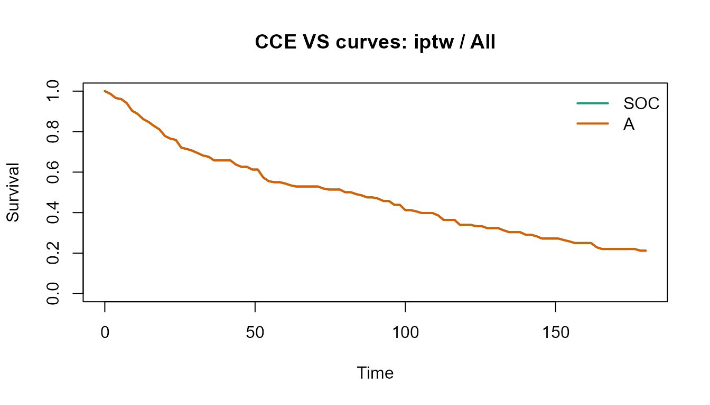
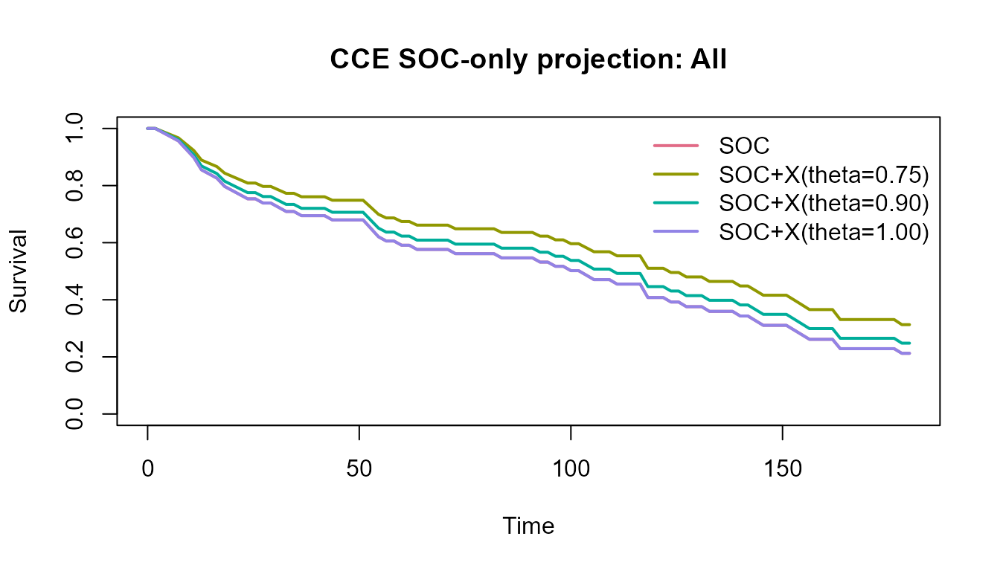

# Public oncology data workflow

## Overview

This article uses the public
[`survival::veteran`](https://rdrr.io/pkg/survival/man/veteran.html)
dataset as a compact real-data example. It is not a production oncology
registry, but it provides a real patient-level time-to-event dataset
with treatment assignment and baseline covariates.

## Prepare the public dataset

``` r
library(cce)
library(survival)

data(veteran, package = "survival")
#> Warning in data(veteran, package = "survival"): data set 'veteran' not found

veteran2 <- veteran
veteran2$arm <- ifelse(veteran2$trt == 1, "SOC", "A")
veteran2$event <- veteran2$status
veteran2$subgroup <- as.character(veteran2$celltype)
veteran2$prior <- factor(veteran2$prior)

head(veteran2)
#>   trt celltype time status karno diagtime age prior arm event subgroup
#> 1   1 squamous   72      1    60        7  69     0 SOC     1 squamous
#> 2   1 squamous  411      1    70        5  64    10 SOC     1 squamous
#> 3   1 squamous  228      1    60        3  38     0 SOC     1 squamous
#> 4   1 squamous  126      1    60        9  63    10 SOC     1 squamous
#> 5   1 squamous  118      1    70       11  65    10 SOC     1 squamous
#> 6   1 squamous   10      1    20        5  49     0 SOC     1 squamous
```

## Fit a VS comparison

``` r
vs_fit <- fit_cce_vs(
  data = veteran2,
  arm = "arm",
  time = "time",
  event = "event",
  covariates = c("karno", "diagtime", "age", "prior", "subgroup"),
  subgroup = "subgroup",
  tau = 180,
  landmark_times = c(90, 180),
  bootstrap = 10,
  seed = 300
)

summary(vs_fit)
#> CCE VS result
#> Label: ok 
#> Warnings: Residual covariate imbalance detected. | g-formula and IPTW disagree on the RMST direction. 
#>   mode   method subgroup tau rmst_arm0 rmst_arm1    delta_rmst landmark_time
#> 1   vs gformula      All 180 17.423484 13.708854 -3.7146293600            90
#> 2   vs gformula      All 180 17.423484 13.708854 -3.7146293600           180
#> 3   vs     iptw      All 180 88.513868 88.517794  0.0039259530            90
#> 4   vs     iptw      All 180 88.513868 88.517794  0.0039259530           180
#> 5   vs gformula    adeno 180  3.637697  3.637374 -0.0003230898            90
#> 6   vs gformula    adeno 180  3.637697  3.637374 -0.0003230898           180
#>   survival_arm0 survival_arm1 delta_survival delta_rmst_lower_ci
#> 1  2.284475e-02  1.062429e-02  -1.222046e-02          -9.1317452
#> 2  1.166565e-03  2.869724e-04  -8.795925e-04          -9.1317452
#> 3  4.753097e-01  4.753350e-01   2.531322e-05         -11.0828252
#> 4  2.121428e-01  2.121664e-01   2.355226e-05         -11.0828252
#> 5 2.693089e-210 2.900255e-222 -2.693089e-210          -0.8764966
#> 6  0.000000e+00  0.000000e+00   0.000000e+00          -0.8764966
#>   delta_rmst_upper_ci delta_survival_lower_ci delta_survival_upper_ci
#> 1         -0.98454187           -3.990590e-02           -1.360854e-04
#> 2         -0.98454187           -2.462785e-02           -1.241037e-09
#> 3          7.69667224           -7.205622e-02            4.926232e-02
#> 4          7.69667224           -6.251200e-02            4.403169e-02
#> 5          0.03391937           -9.203209e-22            1.794115e-24
#> 6          0.03391937          -5.377227e-151           2.166097e-208
```

``` r
plot(vs_fit, method = "iptw", subgroup = "All")
```



``` r
head(as_effects_df(vs_fit))
#>   mode   method subgroup tau rmst_arm0 rmst_arm1    delta_rmst landmark_time
#> 1   vs gformula      All 180 17.423484 13.708854 -3.7146293600            90
#> 2   vs gformula      All 180 17.423484 13.708854 -3.7146293600           180
#> 3   vs     iptw      All 180 88.513868 88.517794  0.0039259530            90
#> 4   vs     iptw      All 180 88.513868 88.517794  0.0039259530           180
#> 5   vs gformula    adeno 180  3.637697  3.637374 -0.0003230898            90
#> 6   vs gformula    adeno 180  3.637697  3.637374 -0.0003230898           180
#>   survival_arm0 survival_arm1 delta_survival delta_rmst_lower_ci
#> 1  2.284475e-02  1.062429e-02  -1.222046e-02          -9.1317452
#> 2  1.166565e-03  2.869724e-04  -8.795925e-04          -9.1317452
#> 3  4.753097e-01  4.753350e-01   2.531322e-05         -11.0828252
#> 4  2.121428e-01  2.121664e-01   2.355226e-05         -11.0828252
#> 5 2.693089e-210 2.900255e-222 -2.693089e-210          -0.8764966
#> 6  0.000000e+00  0.000000e+00   0.000000e+00          -0.8764966
#>   delta_rmst_upper_ci delta_survival_lower_ci delta_survival_upper_ci
#> 1         -0.98454187           -3.990590e-02           -1.360854e-04
#> 2         -0.98454187           -2.462785e-02           -1.241037e-09
#> 3          7.69667224           -7.205622e-02            4.926232e-02
#> 4          7.69667224           -6.251200e-02            4.403169e-02
#> 5          0.03391937           -9.203209e-22            1.794115e-24
#> 6          0.03391937          -5.377227e-151           2.166097e-208
```

## Create an SOC-only projection

For scenario planning, we can keep only the SOC rows and overlay
assumption-based proportional-hazards projections.

``` r
soc_fit <- project_soc_only(
  data = veteran2,
  arm = "arm",
  soc_level = "SOC",
  time = "time",
  event = "event",
  subgroup = "subgroup",
  tau = 180,
  hr_scenarios = c(0.75, 0.90, 1.00),
  target_delta_rmst = 15,
  prior_mean_log_hr = log(0.85),
  prior_sd_log_hr = 0.20,
  bootstrap = 10,
  seed = 400
)

summary(soc_fit)
#> CCE SOC-only projection
#> Label: Projection (assumption-based) 
#>       mode        method subgroup scenario_hr tau rmst_arm0 rmst_arm1
#> 1 soc_only projection_ph      All        0.75 180  96.12878 110.83745
#> 2 soc_only projection_ph      All        0.75 180  96.12878 110.83745
#> 3 soc_only projection_ph      All        0.90 180  96.12878 101.65283
#> 4 soc_only projection_ph      All        0.90 180  96.12878 101.65283
#> 5 soc_only projection_ph      All        1.00 180  96.12878  96.12878
#> 6 soc_only projection_ph      All        1.00 180  96.12878  96.12878
#>   delta_rmst landmark_time survival_arm0 survival_arm1 delta_survival
#> 1  14.708678            90     0.5467462     0.6358276     0.08908133
#> 2  14.708678           180     0.2124268     0.3129010     0.10047422
#> 3   5.524058            90     0.5467462     0.5807741     0.03402784
#> 4   5.524058           180     0.2124268     0.2480209     0.03559415
#> 5   0.000000            90     0.5467462     0.5467462     0.00000000
#> 6   0.000000           180     0.2124268     0.2124268     0.00000000
#>   required_hr pos_proxy delta_rmst_lower_ci delta_rmst_upper_ci
#> 1   0.7455392     0.258           13.485943           15.473156
#> 2   0.7455392     0.258           13.485943           15.473156
#> 3   0.7455392     0.258            5.116966            5.797128
#> 4   0.7455392     0.258            5.116966            5.797128
#> 5   0.7455392     0.258            0.000000            0.000000
#> 6   0.7455392     0.258            0.000000            0.000000
#>   delta_survival_lower_ci delta_survival_upper_ci
#> 1              0.07880162              0.09380862
#> 2              0.08812526              0.10462482
#> 3              0.03039300              0.03562514
#> 4              0.03010239              0.03781181
#> 5              0.00000000              0.00000000
#> 6              0.00000000              0.00000000
```

``` r
plot(soc_fit, subgroup = "All")
```



## Interpretation notes

- VS-mode results are model-based causal estimates under standard
  identifying assumptions.
- SOC-only outputs are projections, not causal estimates.
- In real programs, diagnostics should be interpreted together with data
  provenance, treatment policy definitions, and endpoint adjudication
  rules.
